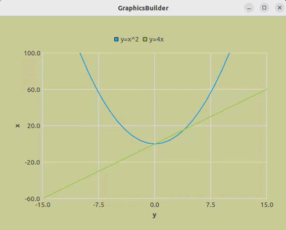
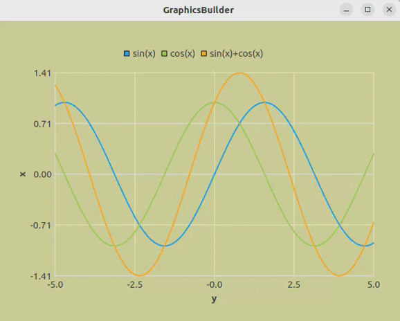

<h1> Purpose of this widget </h1>
  
Lots of programs using charts. Ecpecially when we are modelling processes. We often use programs what need to make special filename extention but it's uncomfortable and hard to include into programs.

  
This widget help you to make much easier your charts and include into project.

<h1> Features </h1>
  <ul>
    <li> Using the library QtCharts. </li>
    <li> Mouse wheel zoom. </li>
    <li> Movement around the chart with keyboard arrows. </li>
    <li> Return 1 to 1 mapping with backspace. </li>
  </ul>
<h1> Work examples </h1>
  <ol> 
    <li>
Displaying two functions

      
    </li>
    <li>
Displaying three functions

       
    </li>
  </ol>
<h1> Usage in other programms </h1>

This is a widget so you can easily add into your programms

<b>Sample of conctructor: </b>

FunctionWindow(QVector&#60;QVector&#60;qreal&#62;&#62; x, QVector&#60;QVector&#60;qreal&#62;&#62; y,
  QString titleX, QString titleY, QVector&#60;QString&#62; legend)

<b>Parameters</b>

<ul>
  <li> QVector&#60;QVector&#60;qreal&#62;&#62; x - x-coordinates for every function </li>
  <li> QVector&#60;QVector&#60;qreal&#62;&#62; y - y-coordinates for every function </li>
  <li> QString titleX - X axis name </li>
  <li> QString titleY - Y axis name </li>
  <li> QVector&#60;QString&#62;&#62; legend - name of every function </li>
</ul>
