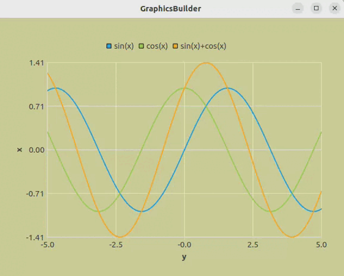

<h1> Назначение виджета </h1>
  
Во многих программах используются графики. Особенно в моделировании каких-либо процессов. И часто приходится 
пользоваться сторонними программами, чтобы их отобразить. Это неудобно и довольно сложно добавить внутрь проекта. 

  
Данная программа позволяет упростить создание графика в виде виджета в две строчки кода

<h1> Особенности программы </h1>
  <ul>
    <li> Использование библиотеки QtCharts </li>
    <li> Возможность зума на колесико мыши (приближение/отдаление) </li>
    <li> Возможность передвижения по графику с помощью стрелок на клавиатуре </li>
    <li> Возможность возврата отображения 1 к 1 с помощью backspace </li>
  </ul>
<h1> Примеры работы </h1>
  <ol> 
    <li>
Отображение двух графиков функций

      
    </li>
    <li>
Отображение трех графиков функций

       
    </li>
  </ol>
<h1> Использование в других программах </h1>

<b>Общий вид конструктора:</b>

FunctionWindow(QVector&#60;QVector&#60;qreal&#62;&#62; x, QVector&#60;QVector&#60;qreal&#62;&#62; y,
  QString titleX, QString titleY, QVector&#60;QString&#62; legend)

<b>Параметры:</b>

<ul>
  <li> QVector&#60;QVector&#60;qreal&#62;&#62; x - координаты по x для каждого из графиков функций </li>
  <li> QVector&#60;QVector&#60;qreal&#62;&#62; y - координаты по y для каждого из графиков функций </li>
  <li> QString titleX - название координаты OX </li>
  <li> QString titleY - название координаты OY </li>
  <li> QVector&#60;QString&#62;&#62; legend - название каждого из графиков </li>
</ul>
